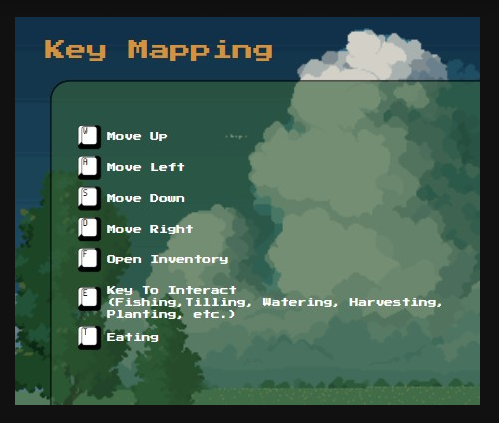

# 🧑‍🌾 OOP-Farming-Game-01

Final project for **Object Oriented Programming**: a farming game in Java.

## 📦 1. Membuka Source Code

### a. Clone Repository

Lakukan salah satu cara berikut:

- **Clone via GitHub Desktop / Git CLI**  
  Clone repositori ke IDE atau folder lokal Anda.

- **Unduh ZIP**  
  Jika Anda mengunduh dalam bentuk ZIP, **extract** file terlebih dahulu sebelum digunakan.

---

## 💻 2. Menjalankan Game

1. Buka IDE Anda (contoh: IntelliJ IDEA, VS Code).
2. Arahkan terminal ke direktori proyek. Contoh: C:\Users\user\Documents\GitHub\Spakbor-Hills>
3. Jalankan perintah berikut di terminal: .\gradlew run
---

## 🕹️ 3. Memulai Permainan

Setelah program berjalan, masukkan informasi berikut:

- Nama Player  
- Gender  
- Nama Farm  

---

## 🎮 4. Key Mapping

Gunakan key mapping berikut untuk memainkan game:

---

